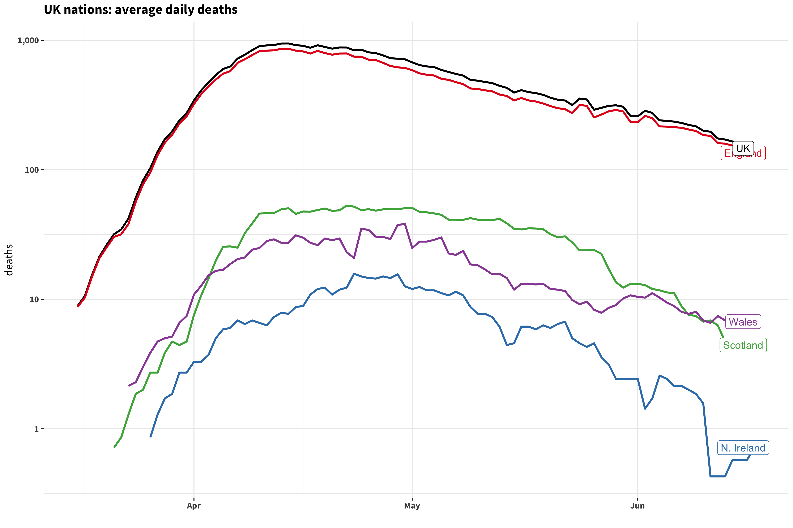
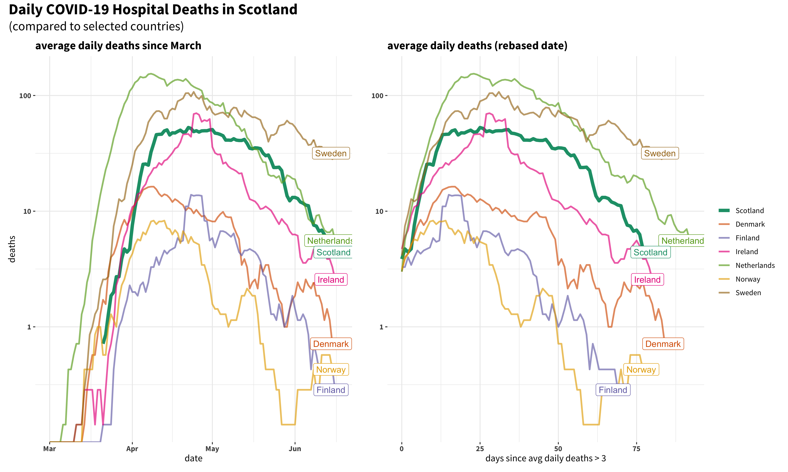
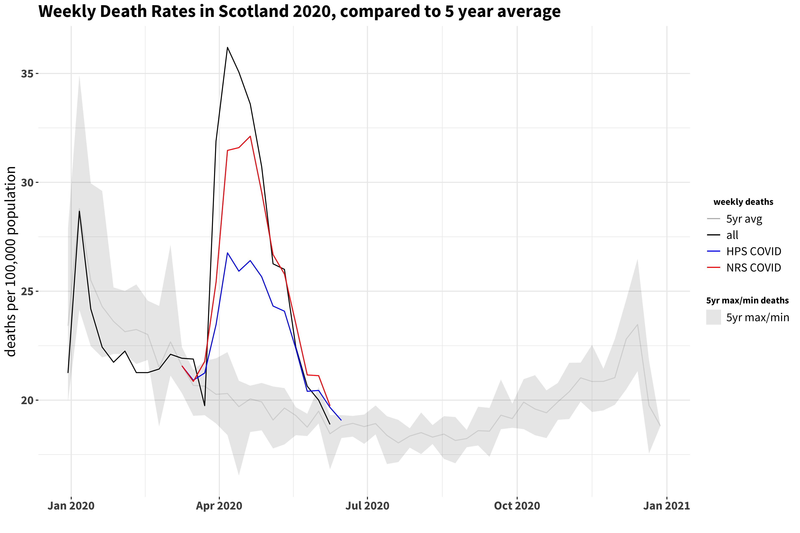
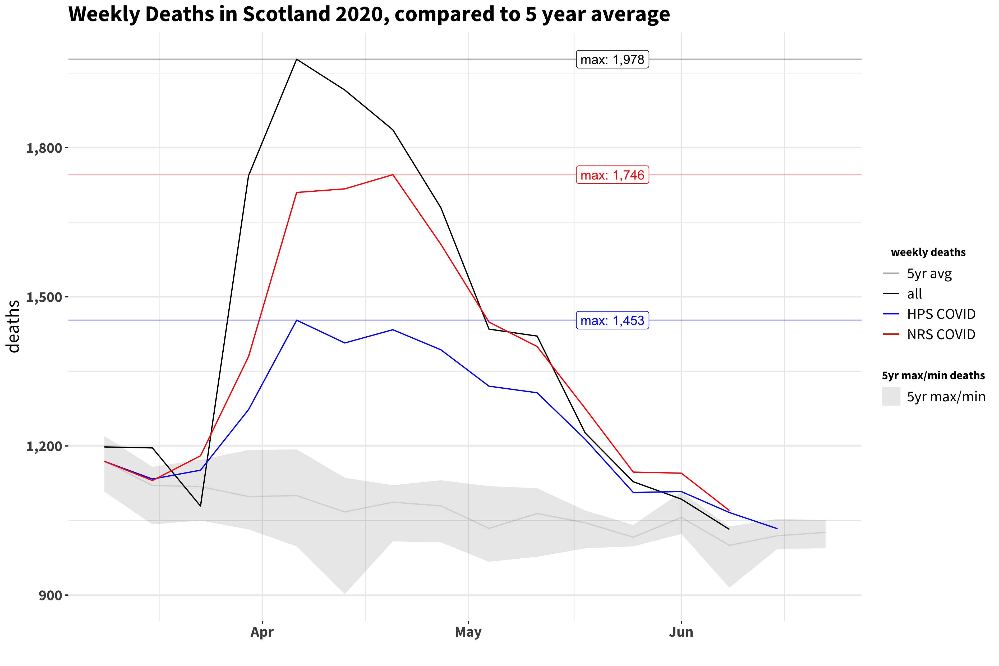
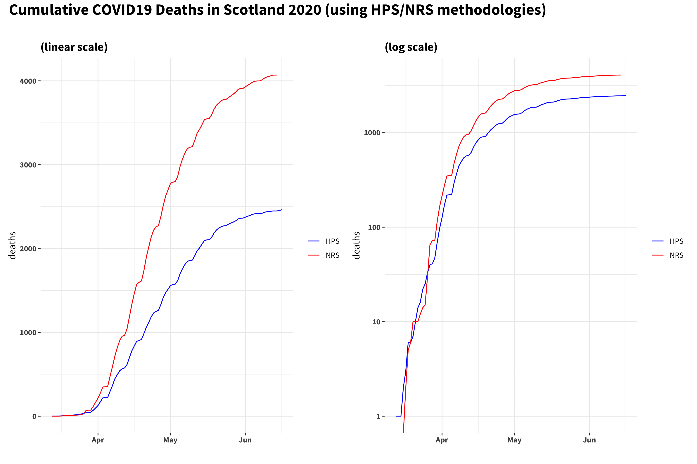

# covid19-scotland
Some quick plots of Scottish deaths data from the COVID-19 outbreak. 

Data published by [National Records Scotland](https://www.nrscotland.gov.uk/), [Health Protection Scotland](https://www.hps.scot.nhs.uk) and the [Scottish Government](https://statistics.gov.scot).

## Caveats

* #not_an_epidemiologist
* all data is provisional and subject to change
* links to data source files and all the code to reproduce the figures can be found in the *R* code files in this repository
* HPS and NRS collate deaths according to different methodologies outlined in [this](https://www.nrscotland.gov.uk/covid19stats) publication

## UK Daily Hospital Deaths (UK comparisons)

A breakdown of the daily deaths in Scotland, England, Wales and Northern Ireland, and how these compare to the total UK figure. 

By plotting the gradient of the above we can look at how the daily deaths are increasing, or decreasing. When the gradient is a constant positive value, the daily deaths are increasing at a constant exponential rate. When the gradient is zero (represented by the horizontal black line) the daily death rate is constant. When the gradient of the log daily deaths drops below zero, this indicates daily deaths are decreasing.

Note: the line fit and confidence intervals are calculated by the *R* default `stat_smooth` function and are intended to provide a rough first order guide!

Looking at the UK and England data we could (arguably ... tentatively) conclude that the peak daily deaths was reached around April 15th. The argument for the other home nations is currently (as of May 1st) much less convincing.

## Scotland's Daily Hospital Deaths (European comparisons)

Here we can see Scotland's daily hospital deaths (weekly rolling average) shown against several other European countries (of broadly comparable size and demographics). On the left, the number of daily deaths are plotted against date, and on the right the date axis is rebased to show each country's deaths data from the day where it first passed more than three deaths per day.

## Comparison of 2020 Weekly Deaths Against Previous 5 Years

Now, a look at the weekly death rate (per 100,000 population). The grey band and grey line show the maximum/minimum levels over 2014 -- 2019 and the *average* over the same time period. The black line then shows the total (all cause) deaths registered so far in 2020. The COVID19 deaths published by HPS *added to the 5 year average* are in blue, and the equivalent NRS figures are in red.

Now, looking at the most recent time period (and focusing on absolute death numbers rather than rates) we can see that the total all cause deaths are still notably above the total from the 5 year average and the NRS reported COVID19 deaths. 

## Evolution of Daily Deaths Numbers from HPS and NRS

Here we can see (note: daily deaths are plotted on a *log* scale) the deaths reported by both HPS and NRS. On the left is the raw daily data. Death registrations numbers can be affected by low reporting on weekends; on the right this is smoothed by applying a retrospective 7 day rolling average.

## Evolution of Cumulative Deaths Numbers from HPS and NRS

The cumulative number of deaths reported by source and day. Shown in linear and log scales.

## Ratio of NRS to HPS Published Deaths

As HPS and NRS use different methodologies to report COVID19 deaths, it might be (marginally) instructive to look at the ratio between them. Looking at both the cumulative deaths and the daily death figures, it looks like the NRS figures are ~1.75✕ the HPS numbers.

