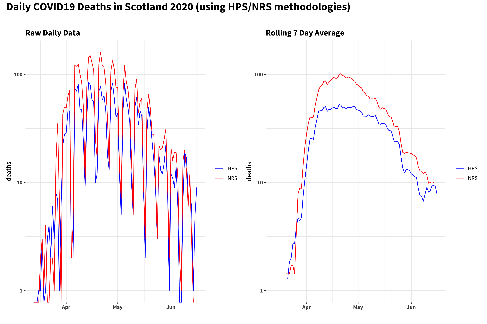
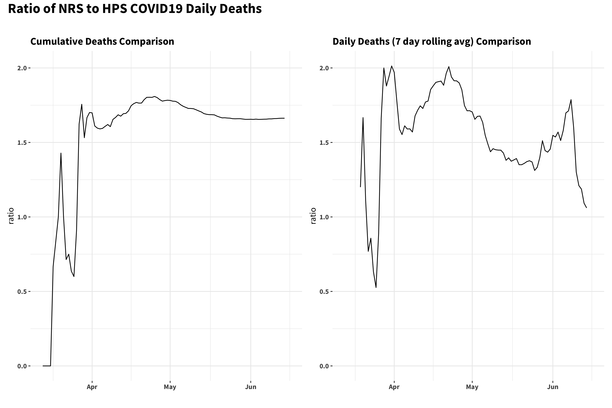

# covid19-scotland
Some quick plots of Scottish deaths data from the COVID-19 outbreak. 

Data published by [National Records Scotland](https://www.nrscotland.gov.uk/), [Health Protection Scotland](https://www.hps.scot.nhs.uk) and the [Scottish Government](https://statistics.gov.scot).

## Caveats

* #not_an_epidemiologist
* all data is provisional and subject to change
* links to data source files and all the code to reproduce the figures can be found in this repository
* HPS and NRS collate deaths according to different methodologies outlined in [this](https://www.nrscotland.gov.uk/covid19stats) publication

## Comparison of 2020 Weekly Deaths Against Previous 5 Years

First, a look at the weekly death rate (per 100,000 population). The grey band and grey line show the maximum/minimum levels over 2014 -- 2019 and the *average* over the same time period. The black line then shows the total (all cause) deaths registered so far in 2020. The COVID19 deaths published by HPS *added to the 5 year average* are in blue, and the equivalent NRS figures are in red.

Now, looking at the most recent time period (and focussing on absolute death numbers rather than rates) we can see that the total all cause deaths are still notably above the total from the 5 year average and the NRS reported COVID19 deaths. 

## Evolution of Daily Deaths Numbers from HPS and NRS

Here we can see (note: daily deaths are plotted on a *log* scale) the deaths reported by both HPS and NRS. On the left is the raw daily data. Death registrations numbers can be affected by low reporting on weekends; on the right this is smoothed by applying a retrospective 7 day rolling average.

## Evolution of Cumulative Deaths Numbers from HPS and NRS

The cumulative number of deaths reported by source and day. Shown in linear and log scales.

## Ratio of NRS to HPS Published Deaths

As HPS and NRS use different methodologies to report COVID19 deaths, it might be (marginally) instructive to look at the ratio between them. Looking at both the cumulative deaths and the daily death figures, it looks like the NRS figures are settling down to be ~1.6✕ the HPS numbers.

